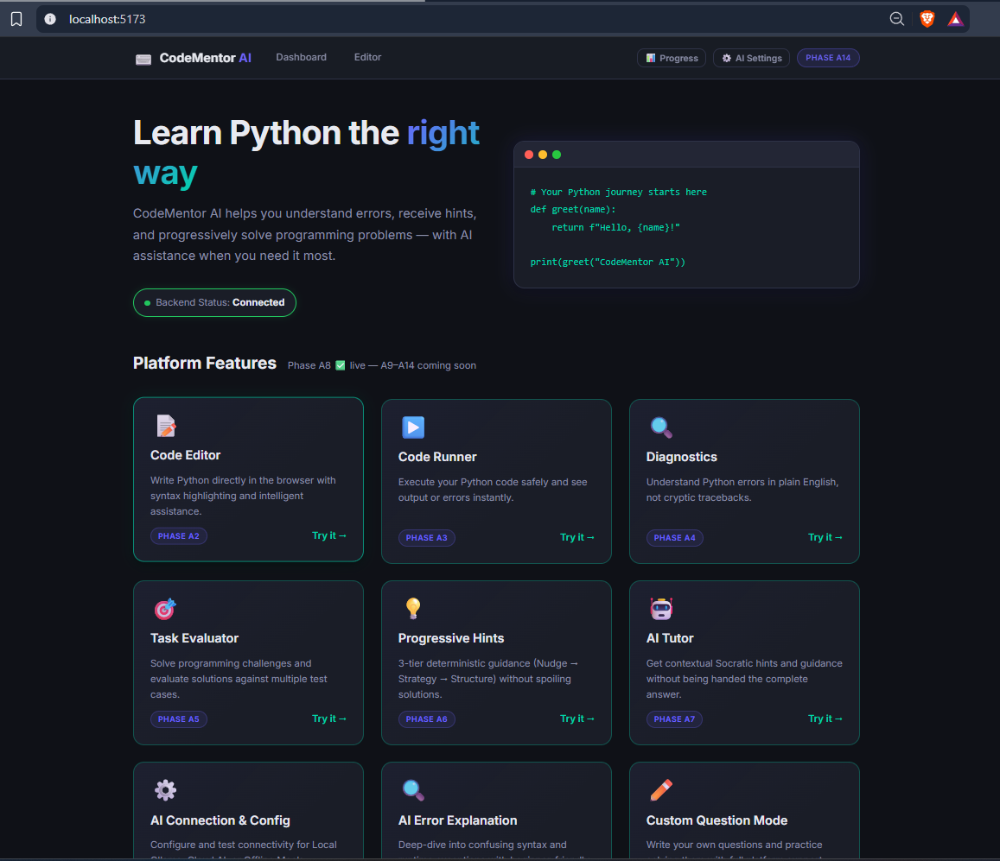
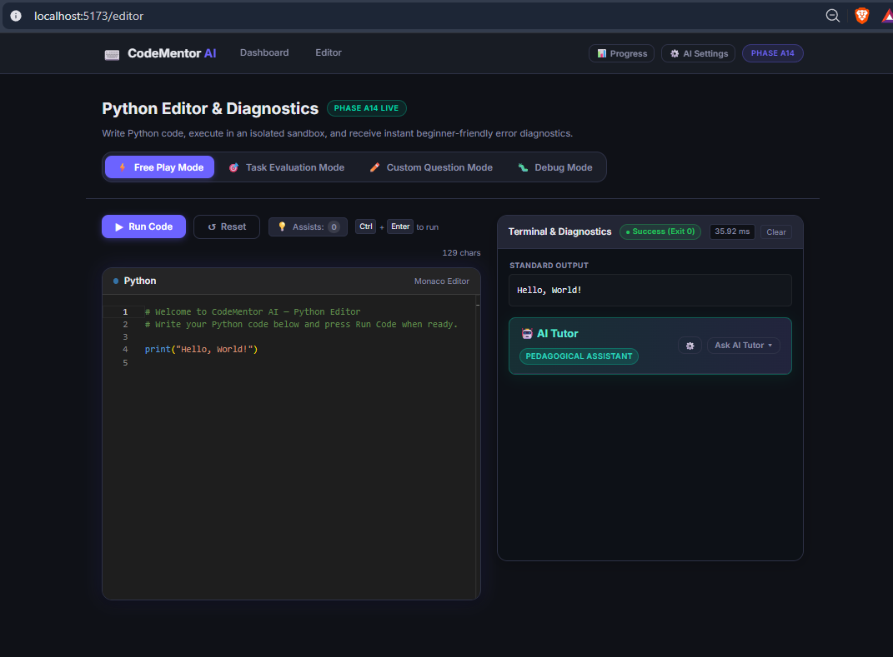
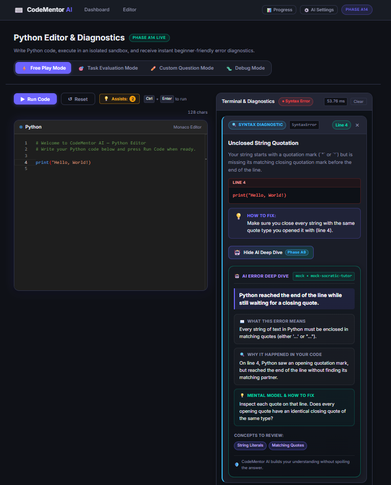
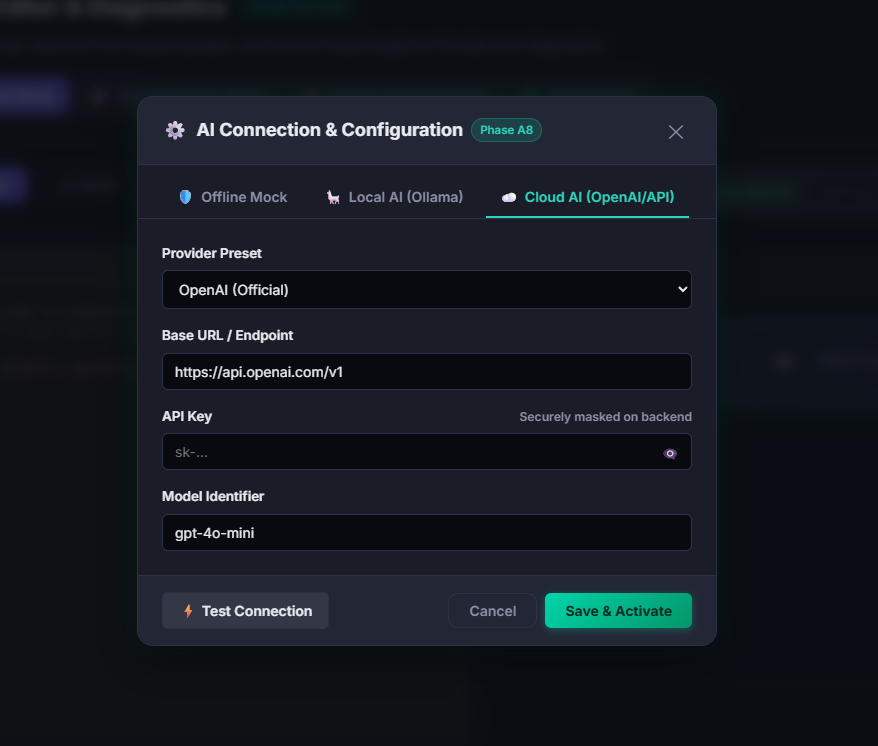

# CodeMentor AI

> An AI-powered interactive Python learning and coding platform for beginners.

CodeMentor AI helps students learn Python by writing, running, debugging, and improving code with automated diagnostics, task evaluation, progressive hints, and AI-powered tutoring.

## ✨ Features

- 🐍 Interactive Python Editor with Monaco Editor
- ⚡ Controlled Python Code Execution
- 🔍 Beginner-Friendly Error Diagnostics
- 🎯 Automated Task & Test-Case Evaluation
- 💡 Progressive Rule-Based Hints
- 🤖 AI Tutor & AI Error Explanation
- ✏️ Custom Question Mode
- 🐞 Debug Mode
- 📊 Progress & Score Tracking
- ⚙️ Multiple AI Provider Support

## 🤖 AI Architecture

CodeMentor AI uses a **hybrid AI architecture** combining deterministic programming systems with LLMs.

```text
                  CodeMentor AI
                       │
                React Frontend
                       │
                 Flask REST API
                       │
        ┌──────────────┼──────────────┐
        ↓              ↓              ↓
   Code Runner    Diagnostics     Evaluator
        │              │              │
        └──────────────┼──────────────┘
                       ↓
                Hint / AI Layer
                       │
          ┌────────────┼────────────┐
          ↓            ↓            ↓
       OpenAI       Claude       Gemini
          │
       Ollama
     (Local LLM)
```

The platform can use rule-based systems for deterministic feedback and LLMs for contextual tutoring, deeper explanations, and personalized guidance.

## 🧠 AI Workflow

```text
Student Code
     ↓
Run / Evaluate
     ↓
Detect Problem
     ↓
Rule-Based Hint
     ↓
AI Tutor
     ↓
Student Improves Code
     ↓
Run Again
```

AI responses can be generated using cloud LLM APIs or local models through Ollama, allowing the system to remain flexible across different AI providers.

## 🛠️ Tech Stack

| Category | Technologies |
|---|---|
| Frontend | React, Vite, Monaco Editor |
| Backend | Python, Flask |
| Database | SQLite |
| AI | OpenAI, Claude, Gemini, Ollama |
| APIs | REST, JSON |
| Testing | Pytest |
| Version Control | Git, GitHub |

## 📸 Screenshots

### Dashboard / Home


### Python Editor & Diagnostics


### AI Error Explanation / AI Tutor


### AI Connection & Configuration

